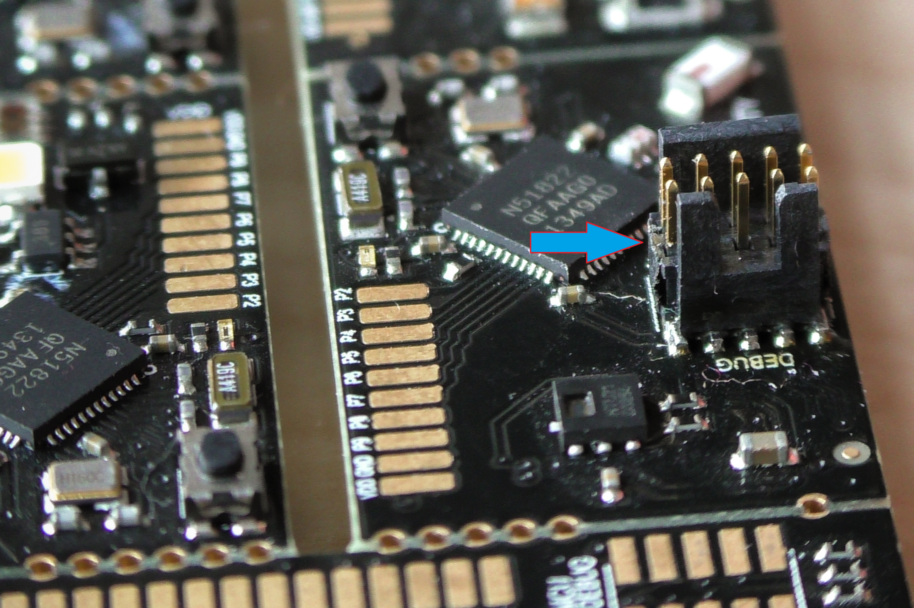

# The WunderBar Sensor Modules Firmware Repository - Preliminary Stages of Development

Welcome to the Sensor Modules Firmware Repository. This repository contains the latest version of the WunderBar sensor modules firmware. Please note that this version of the firmware ***does not*** currently run on the sensor modules, due to a number of hardware limitations. This *will be* the firmware available on the sensor modules once the new hardware version of the WunderBar is released, in the first quarter of 2015.

**This firmware version is a "work in progress" and currently only includes the basic functionality of retrieving values from the sensor.**

Despite the fact that it isn't currently available on the sensor modules, you could still use this firmware version. To do that you would need to make sure perquisites are met.

## Prerequisites for using this firmware version

- Solder a Standard 9-pin Samtec FTSH connector for the ARM CoreSight 10 pin SWD/JTAG header. See [this specification document](http://infocenter.arm.com/help/index.jsp?topic=/com.arm.doc.ddi0314h/Chdhbiad.html) for additional details

The connector should be soldered to the board in the following manner:

 

- Connect the connector to a Segger flasher. You could use [this one](https://www.segger.com/jlink-lite-cortexm.html), for instance.

- Obtain a license for the [nRF SDK](https://www.nordicsemi.com/eng/Products/Bluetooth-Smart-Bluetooth-low-energy/nRF51822), soft device version 7. You can obtain a license when buying a development kit.

## Installing the firmware

1. Clone the repository on your local machine. Each folder contains a different module which is denoted by the name of the folder.
2. Initialize and update it using the following: 
	
	`git submodule init` 
and 
	`git submodule update`

3. Download the [nRF SDK](https://www.nordicsemi.com/eng/Products/Bluetooth-Smart-Bluetooth-low-energy/nRF51822) and extract it in the respective folder.
4. Navigate to the folder of the sensor you wish to flash.
5. Flash the software by typing `make flash` 
